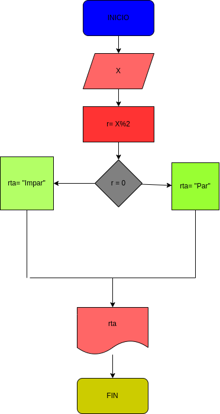

# Ejercicio N.4

## verificar si un numero es Par o Impar 

# Analisis 

variable de entrada (imput)

X: numero a verificar

variable del proceso y  salida (prosessing, storange, output)

rta: resultado de la verificacion numero Par o Impar 

# DISEÑO 

# CONSTRUCCION 
